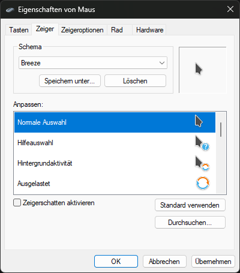

## Breeze Cursors for Windows

### Preview

### Installation

1. Clone the GitHub repo or download it as `*.zip`.  
    
2. Extract the contents of the `*.zip` archive.
3. Right-click `Breeze\Breeze.inf` or `Breeze_Snow\Breeze_Snow.inf` and select Install.  
    
4. Open `Control Panel` → `Hardware and Sound` → `Mouse` → `Pointer` tab.
    - Alternatively, press `Win`+`R`, enter `main.cpl`, and press `Enter`.
5. Select Breeze or Breeze Snow and click Apply.

### How it was made

- Install [win2xcur](https://pypi.org/project/win2xcur/): `pipx install win2xcur`
- Clone [KDE/breeze](https://github.com/KDE/breeze)
- Navigate to `breeze/cursors/Breeze/Breeze/cursors`
- Convert everything with win2xcur
  - Run in bash: `mkdir ../cursors-win && x2wincur --output-dir ../cursors-win *`
- Place a `*.inf` file in our `cursors-win` folder.
- Win!

### See also
- https://invent.kde.org/plasma/breeze
  - https://github.com/KDE/breeze/tree/master/cursors/Breeze
  - https://github.com/KDE/breeze/tree/master/cursors/Breeze_Snow
- https://github.com/quantum5/win2xcur#readme
- https://github.com/black7375/Breeze-Cursors-for-Windows
